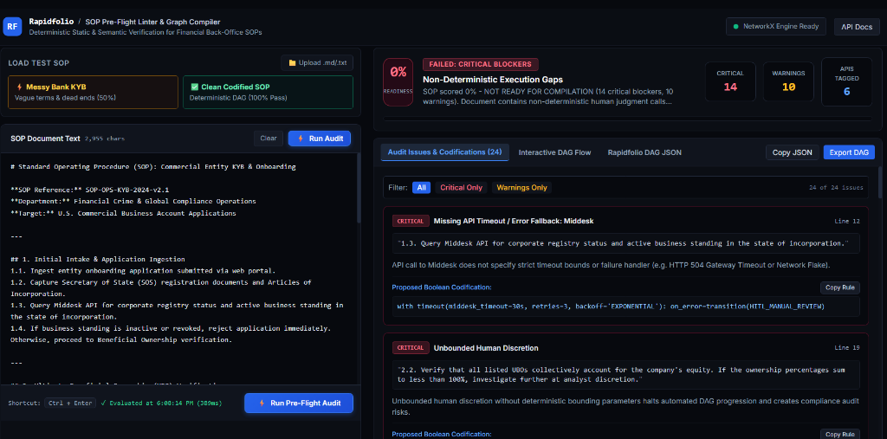
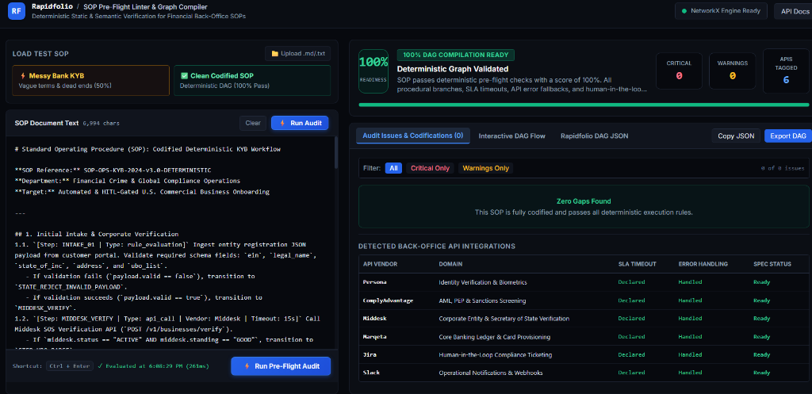
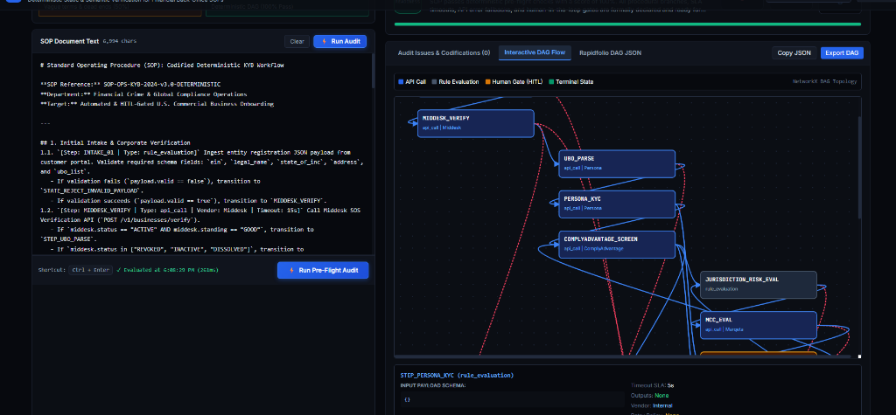
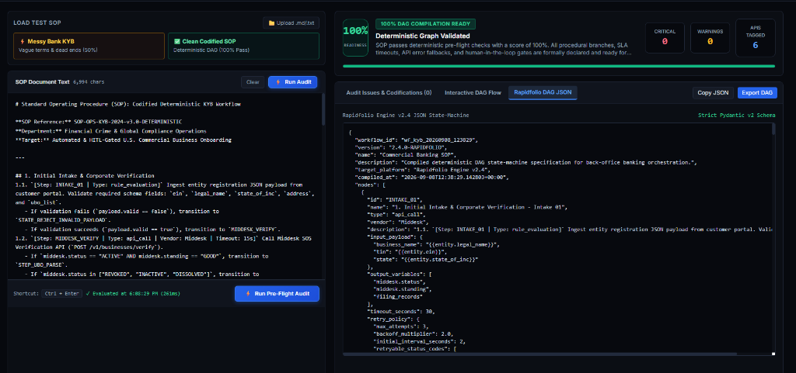

# Rapidfolio SOP Pre-Flight Linter & Deterministic Graph Compiler

[](https://www.python.org/downloads/)
[](https://fastapi.tiangolo.com/)
[](https://networkx.org/)
[](https://docs.pydantic.dev/)
[]()

An enterprise-grade POC tool for **Rapidfolio** that ingests raw banking & fintech Standard Operating Procedures (SOPs), performs deterministic static & semantic linting, flags human-judgment ambiguities and unhandled edge cases, and compiles compliant procedural workflows into executable **Rapidfolio DAG State-Machine Specifications (JSON)**.

---


---

## 📸 Application Showcase

### 1. The "Messy" Audit Failure (The Problem)
Rapidfolio instantly identifies subjective language, unbounded human discretion, and missing SLAs in standard compliance documents that would cause automated pipelines to crash.


### 2. The "Clean" Score & Vendor Extraction (The Solution)
Once ambiguities are resolved, the engine validates the workflow and automatically extracts 3rd-party API dependencies, fallback paths, and strict SLA timeouts.


### 3. The Generated DAG Visualization
The validated text is compiled into a Directed Acyclic Graph (DAG), mapping every API call, rule evaluation, and human-in-the-loop checkpoint.


### 4. The Machine-Readable Output
The final output is a strict, Pydantic-validated state-machine JSON payload, ready to be deployed directly into execution engines like Temporal or AWS Step Functions.



## âš¡ Problem Context
Financial institutions frequently have messy, contradictory back-office SOPs filled with subjective human judgment calls (*"flag if entity looks sketchy"*, *"review at analyst discretion"*) and unhandled edge cases (e.g., API gateway timeouts, unlinked escalations, beneficial ownership discrepancies). When onboarding new banks onto Rapidfolio, engineers must manually audit and codify these SOPs before turning them into 99.9%+ deterministic DAG workflows.

This tool automates that pre-flight audit and compilation pipeline.

---

## 🏗️ Architecture & Core Components

```
rapidflow/
├── README.md
├── requirements.txt
├── run.py                          # Server launcher (FastAPI + Uvicorn)
├── sample_sops/                    # Built-in sample SOPs for rapid demonstration
│   ├── messy_kyb_sop.md            # Realistic messy U.S. Bank KYB manual (50-60% score)
│   └── clean_kyb_sop.md            # Fully codified, deterministic KYB SOP (100% score)
├── src/
│   ├── api/                        # FastAPI REST API & SPA host
│   │   ├── app.py
│   │   └── routes.py
│   ├── compiler/                   # Rapidfolio DAG Compiler & Graph Builder
│   │   ├── dag_exporter.py
│   │   └── graph_builder.py
│   ├── linter/                     # Static & Semantic Analysis Engine
│   │   ├── ambiguity_scanner.py    # Subjectivity & vague terms heuristic scanner
│   │   ├── graph_analyzer.py       # NetworkX DiGraph topology & dead-end validator
│   │   ├── rules.py                # Regex rules & programmatic boolean codifications
│   │   ├── scoring.py              # 0-100% Deterministic Readiness Score calculator
│   │   └── vendor_tagger.py        # Financial API tagger (Persona, Middesk, Marqeta, etc.)
│   ├── llm/                        # Optional LiteLLM/Gemini refinement with offline fallback
│   │   └── client.py
│   └── schemas/                    # Strict Pydantic v2 data models
│       ├── audit.py
│       ├── dag.py
│       └── sop.py
├── static/                         # Modern Dark-Mode SPA
│   ├── css/styles.css
│   ├── js/app.js
│   └── index.html
└── tests/                          # 16 Pytest unit & integration tests
    ├── test_ambiguity_scanner.py
    ├── test_api.py
    ├── test_compiler.py
    ├── test_extended.py
    ├── test_graph_analyzer.py
    ├── test_scoring.py
    └── test_vendor_tagger.py
```

---

## 🔍 Key Features

1. **Ambiguity & Subjectivity Scanner (`src/linter/ambiguity_scanner.py`)**:
   - Flags non-deterministic phrases (`"looks sketchy"`, `"analyst discretion"`, `"reasonable effort"`, `"promptly"`, `"as needed"`).
   - Proposes concrete boolean/programmatic replacements (e.g. `risk_engine.score > 75 OR sanctions_match == True`).

2. **NetworkX Graph Topology & Edge-Case Analyzer (`src/linter/graph_analyzer.py`)**:
   - Converts procedural steps into directed graph (`DiGraph`).
   - Discovers **dead-end steps** (e.g., routing to "Tier 2 Review" with no downstream transition or timeout).
   - Identifies **infinite loops and circular logic** using `nx.simple_cycles()`.
   - Flags **unhandled API exceptions** (e.g., HTTP 504 gateway timeouts on Persona KYC checks).

3. **Vendor Integration Tagger (`src/linter/vendor_tagger.py`)**:
   - Detects financial back-office APIs (*Persona*, *ComplyAdvantage*, *Middesk*, *Marqeta*, *Jira*, *Slack*).
   - Validates SLA timeout declarations, network error recovery policies, and input/output payload schemas.

4. **Deterministic Readiness Scoring (`src/linter/scoring.py`)**:
   - Calculates a weighted score from 0 to 100%.
   - Status classifications: `READY_FOR_COMPILATION` (Green), `REQUIRES_REMEDIATION` (Amber), `CRITICAL_BLOCKERS` (Red).

5. **Rapidfolio DAG State-Machine Exporter (`src/compiler/dag_exporter.py`)**:
   - Compiles validated SOPs into Rapidfolio-compliant JSON state-machines (`workflow_id`, `nodes`, `edges`, conditional expressions, `hitl_checkpoints`).

6. **Interactive Dark-Mode UI (`static/index.html`)**:
   - Side-by-side view with Markdown editor, presets, and live line count.
   - Interactive Cytoscape.js DAG visualizer with node payload/SLA inspector.
   - Expandable audit issue cards with one-click **"Copy Rule"** and **"Apply Codification"** actions.
   - One-click JSON DAG export and download.

---

## 🚀 Getting Started

### 1. Prerequisites
- Python 3.11+

### 2. Installation
```bash
# Clone or open directory
cd d:/Rapidflow

# Install dependencies
pip install -r requirements.txt
```

### 3. Launch the Application
```bash
python run.py
```
Open your browser and navigate to: **[http://127.0.0.1:8000](http://127.0.0.1:8000)**

---

## 🧪 Running Automated Tests
Run the deterministic Pytest suite:
```bash
python -m pytest -v
```
All 16 tests assert exact readiness scores, NetworkX graph integrity, vendor spec detection, and API payload contracts.

---

## 📑 REST API Documentation
Once running, explore interactive Swagger docs at:
- **Swagger UI**: `http://127.0.0.1:8000/docs`
- **ReDoc**: `http://127.0.0.1:8000/redoc`

### Key Endpoints:
- `POST /api/audit`: Runs full static & semantic linting on raw SOP text, returning `AuditReport`.
- `POST /api/compile`: Audits and compiles SOP text into `RapidfolioDAG` JSON.
- `GET /api/samples`: Lists available sample SOP files (`messy_kyb_sop.md`, `clean_kyb_sop.md`).
- `GET /api/samples/{filename}`: Fetches raw content of a sample SOP.
- `GET /api/health`: Health status.

